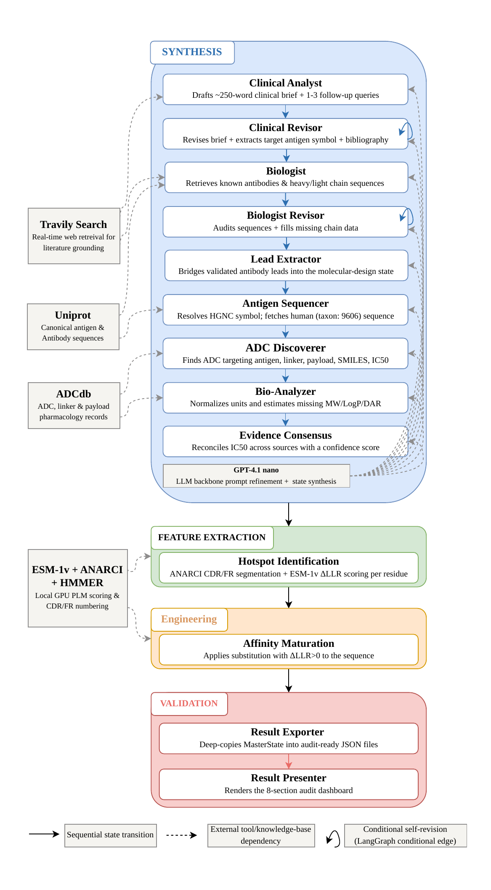

# REVEAL: Multi-Agent Framework for Autonomous Synthesis of Disparate Clinical Evidence and Sequence Engineering of ADCs

REVEAL is a [LangGraph](https://github.com/langchain-ai/langgraph)-based multi-agent pipeline for antibody-drug conjugate (ADC) discovery. It orchestrates LLM-driven reasoning agents (GPT-4.1-nano) alongside deterministic bioinformatics tooling — sequence retrieval, ANARCI-based antibody validation, and ESM-1v protein language model scoring — to go from a free-text clinical prompt to an engineered, hotspot-optimized antibody sequence.

## Overview

Given a clinical/oncology prompt (e.g. a target antigen or disease context), REVEAL:

1. Analyzes the clinical evidence and iteratively self-revises its reasoning.
2. Extracts candidate antibody/ADC leads from that analysis.
3. Validates and retrieves real VH/VL sequences for those leads.
4. Identifies CDR hotspots and scores mutations with ESM-1v.
5. Applies affinity-maturing mutations and reports the engineered sequence, along with an audited, per-run summary of what was verified vs. inferred.

The system is built as a directed graph of nodes — some are autonomous LLM agents that reason and revise their own output, others are deterministic tool-calling or computational steps — compiled and executed with LangGraph.

## Architecture

The pipeline runs in four phases:

| Phase | Nodes |
|---|---|
| **Synthesis** | Clinical Analyst → Clinical Revisor (self-revision loop) → Biologist → Biologist Revisor (self-revision loop) → Lead Extractor → Antigen Sequencer → ADC Discoverer → Bio-Analyzer → Evidence Consensus |
| **Feature Extraction** | Hotspot Identification (ANARCI numbering + ESM-1v scoring) |
| **Engineering** | Affinity Maturation (mutation selection and application) |
| **Validation & Reporting** | Result Exporter → Result Presenter |

**Node vs. agent:** "node" refers to a step in the LangGraph structure; "agent" refers to a node whose behavior is driven by autonomous LLM reasoning. The Clinical Analyst, Clinical Revisor, Biologist, and Biologist Revisor are true reasoning agents with self-critique loops; the remaining nodes are deterministic tool-calling or computational steps.

<p align="center">
  <a href="docs/architecture.pdf">
    
  </a>
</p>

*(click for full-resolution PDF)*

### External data sources

- **Thera-SAbDab** and **RCSB PDB** — antibody structure and sequence retrieval
- **UniProt** — antigen sequence retrieval
- **Tavily** — web search for supplementary evidence

## Repository layout

| File | Responsibility |
|---|---|
| `config.py` | Environment setup, API client initialization (LLM, Tavily), shared prompt text |
| `sequence_lookup.py` | Tiered antibody VH/VL sequence retrieval cascade and supporting lookup tables |
| `tools.py` | LangChain tool definitions (web search, UniProt, ADC database lookups) and the tool registry |
| `state.py` | Shared graph state schema (`MasterState`) and reflection/answer models used by the self-revision loops |
| `nodes_clinical.py` | Clinical Analyst and Clinical Revisor agents |
| `nodes_biology.py` | Biologist and Biologist Revisor agents, plus lead extraction and the ANARCI validation gate |
| `nodes_discovery.py` | Antigen sequencing, ADC discovery, bioactivity analysis, and evidence consensus nodes |
| `esm_engineering.py` | ESM-1v model loading, CDR hotspot identification, chain scanning, and mutation application |
| `nodes_reporting.py` | Summary generation and JSON/text report export |
| `graph_build.py` | Assembles all nodes into the compiled LangGraph pipeline |
| `benchmark.py` | Benchmark prompt set and run loop used to evaluate the pipeline across repeated trials |
| `benchmark_analysis.py` | Standalone, independently run post-hoc analysis tool for aggregating results across benchmark runs (not part of the pipeline's execution path) |
| `main.py` | Entrypoint |

### Import graph

```
main.py
  └── benchmark.py
        └── graph_build.py
              ├── nodes_clinical.py ──┐
              ├── nodes_biology.py ───┤
              ├── nodes_discovery.py ─┼── state.py
              ├── esm_engineering.py ─┤
              └── nodes_reporting.py ─┘
                    (nodes_biology.py and nodes_discovery.py also
                     depend on tools.py and config.py)

tools.py
  ├── config.py          (search tooling)
  └── sequence_lookup.py  (antibody sequence retrieval)
```

`benchmark_analysis.py` is intentionally excluded from this graph. It is never imported by any pipeline module and is run manually as a separate CLI tool.

## Output

Each run produces:

- **`ADC_Report_*.json`** — the full structured output of the pipeline for that run.
- **`ADC_RunSummary_*.txt`** — a companion human-readable summary for that same run, listing the target antigen, per-lead classification (sequence present / no sequence / fabricated / fallback), audit depth, and hotspot/LLR statistics.

For aggregate analysis across many runs (Wilson confidence intervals on boundary proportions, per-prompt breakdowns, cross-repeat determinism checks), use `benchmark_analysis.py`:

```bash
python benchmark_analysis.py /path/to/json_dir --outdir results/
```

## Getting started

### Requirements

- Python 3.9+
- [`biopython`](https://biopython.org/)
- [`langgraph`](https://github.com/langchain-ai/langgraph), [`langchain`](https://github.com/langchain-ai/langchain), `langchain-openai`, `langchain-community`
- [`tavily-python`](https://github.com/tavily-ai/tavily-python)
- [`fair-esm`](https://github.com/facebookresearch/esm), `torch`
- `beautifulsoup4`, `requests`, `pydantic`
- Optional: [ANARCI](https://github.com/oxpig/ANARCI) + HMMER, for antibody numbering-based validation. If unavailable, the pipeline falls back to API-based sequence retrieval without the numbering gate.

### Environment variables

The pipeline requires API credentials for the LLM and search providers:

```bash
export OPENAI_API_KEY=...
export TAVILY_API_KEY=...
```

If unset, you'll be prompted for them interactively at startup.

### Running the pipeline

```bash
python main.py
```

By default this runs the full benchmark suite defined in `benchmark.py`. To run a single prompt instead, edit the switches at the top of that file:

```python
RUN_FULL_BENCHMARK = False
SINGLE_TEST_INDEX = 0
```

## Citation

If you use REVEAL in your research, please cite the accompanying paper (citation details to be added upon publication).

